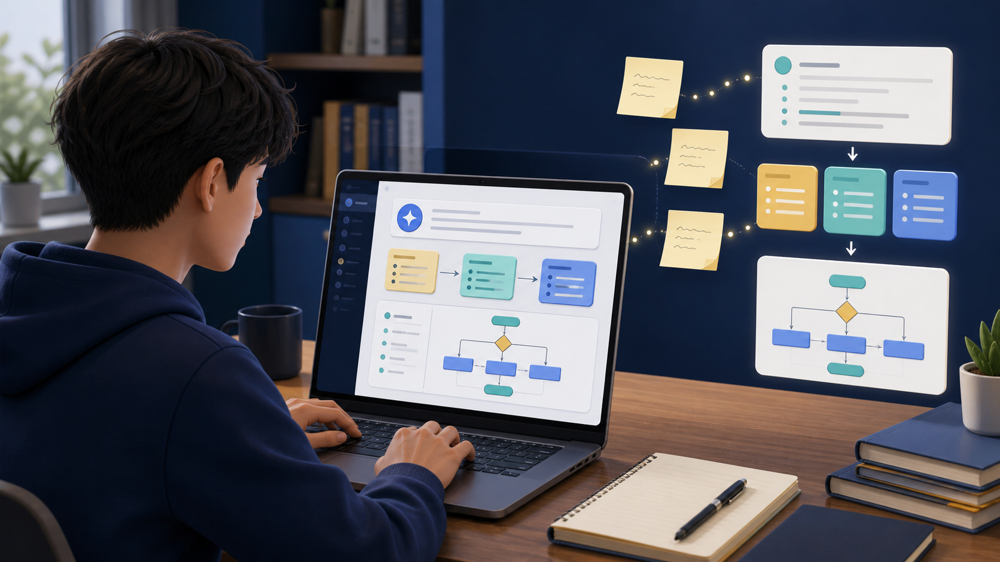
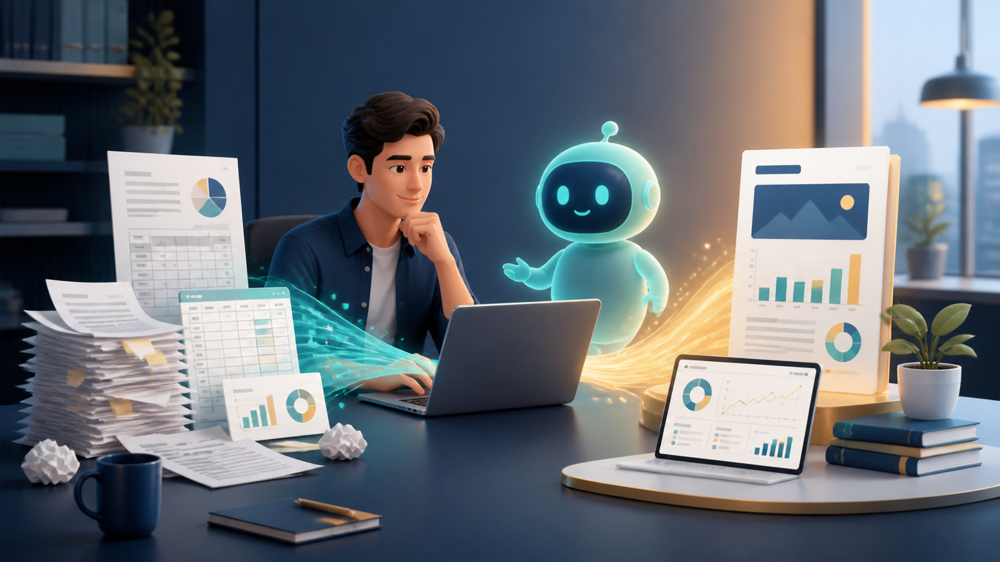
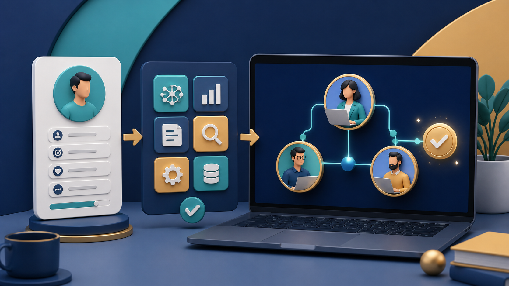
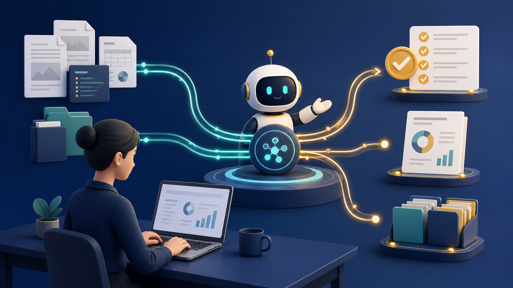
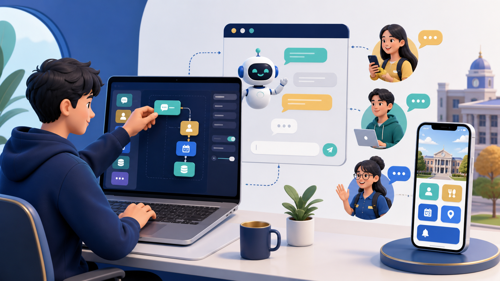

# 六大课程模块

本手册以 WorkBuddy 协同完成真实职业任务为线索，将 21 节实践课组织为六个循序渐进的模块。每个模块都可以独立选学，也可以按顺序完成。

## 01｜AI 基础与结构化表达

从问题定义和提示词结构开始，学习把模糊需求交给 WorkBuddy，并转化为清晰的任务清单、Markdown 和流程图。

## 02｜智能办公与信息处理

用 WorkBuddy处理真实的文档、表格和信息整理任务：统一格式、分析数据、生成汇报，并完成必要的人工复核。

## 03｜WorkBuddy 基础与能力扩展

配置个人画像、Skill、专家与专家团，把一次性对话升级为可复用、可协作、可验证的 WorkBuddy 工作流。

## 04｜内容创作、连接与自动化

围绕 PPT、海报、HTML 和自动化任务，练习用 WorkBuddy 把创意、外部工具、定时任务和交付流程连接起来。

## 05｜行业研究、MCP 与文件处理

面向行业研究、资料检索和批量文件处理，学习让 WorkBuddy 连接工具、核验依据、整理数据并输出可复核结论。

## 06｜零代码应用与智能体

以本地小游戏、个人主页和校园问答为案例，用 WorkBuddy 构建、测试和迭代零代码应用与智能体，完成从练习到可用成果的最后一步。

