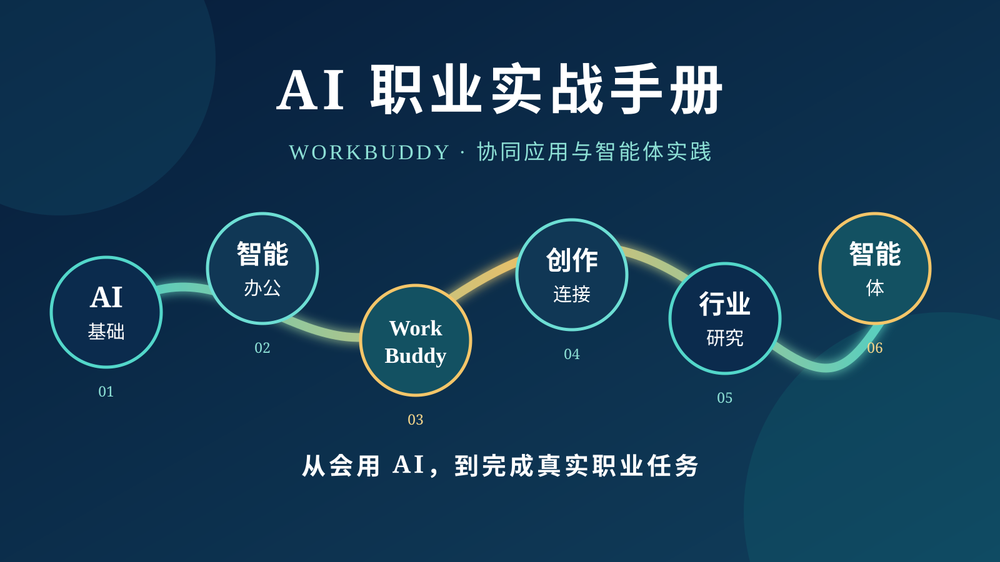

# AI 职业实战手册：WorkBuddy 协同应用与智能体实践

> 从人机协同到智能体开发 · 21 课实践教程

这是一套面向高校课堂、教师培训和自主学习的生成式 AI 实践课程。通过 21 节任务课，学习者可从提示词与结构化表达起步，逐步完成智能办公、内容创作、工具连接、行业研究、零代码应用与智能体搭建，沉淀个人 AI 职业实践作品集。

这是一套面向高校课堂、教师培训与自主学习的生成式 AI 实践手册。内容由 21 节独立实践课整合而成，按照“AI 基础—智能办公—内容创作—连接与自动化—行业应用—零代码与智能体”的学习路径重新编排，并统一了版式、标题层级、提示词样式、页眉页脚和目录结构。

为保留原始操作截图的清晰度，手册分为上、下两册发布。两册均提供可编辑的 DOCX 与便于阅读、打印的 PDF。

## 下载

| 分册 | 内容范围 | 可编辑版 | 阅读版 | 页数 |
|---|---|---|---|---:|
| 上册 | 第 1–11 课：基础、智能办公与内容创作 | [DOCX](docs/大学生生成式AI应用实践手册_上册_开源版.docx) | [PDF](docs/大学生生成式AI应用实践手册_上册_开源版.pdf) | 113 |
| 下册 | 第 12–21 课：连接、自动化、行业应用与智能体 | [DOCX](docs/大学生生成式AI应用实践手册_下册_开源版.docx) | [PDF](docs/大学生生成式AI应用实践手册_下册_开源版.pdf) | 70 |

完整的 21 课目录、能力目标与实践成果见 [课程目录](COURSE_OUTLINE.md)。

## 课程实践数据

本课程配套的练习文档、模拟数据、图片包和 HTML 模板已整理至 [datasets](datasets/) 目录。每个文件的适用任务与使用提示见 [数据使用说明](DATASETS.md)。

## 课程结构

六大模块的简要介绍与配图见 [课程模块介绍](COURSE_MODULES.md)。

1. AI 基础与结构化表达（第 1–3 课）
2. 智能办公与信息处理（第 4–5 课）
3. WorkBuddy 基础与能力扩展（第 6–9 课）
4. 内容创作、连接与自动化（第 10–14 课）
5. 行业研究、MCP 与文件处理（第 15–18 课）
6. 零代码应用与智能体（第 19–21 课）

## 使用建议

- 教师可按模块选课，也可将 21 课作为完整实践课程连续使用。
- 学习者应保存每一课的提示词、操作记录、输出文件和反思说明，形成个人 AI 实践档案。
- 涉及法律、财务、隐私、账号连接或自动化操作时，应进行人工复核，并遵守所在单位的制度与相关法律法规。
- 软件界面和模型能力会持续更新；如果实际界面与截图不同，请以平台当前版本为准，优先理解任务目标和操作逻辑。

## 图片与文件说明

手册共保留 356 张教学图片。绝大多数图片按原始文件嵌入；仅对 3 张尺寸或体积异常大的图片进行了高质量缩放压缩，以兼顾清晰度、打开速度和 GitHub 单文件限制。

## 参与改进

欢迎通过 Issue 提交勘误、软件版本变化、课堂案例或改进建议。提交内容前请删除个人信息、密钥、账号标识和不应公开的教学数据。具体要求见 [贡献指南](CONTRIBUTING.md)。

## 使用许可

除另有说明外，本项目的原创文字与编排采用 [CC BY-NC 4.0](LICENSE.md) 许可。转载、改编或用于非商业教学时，请保留来源、提供许可链接，并标注是否进行了修改；任何商业用途均须事先取得作者书面授权。

> © 2026 作者保留署名权。未经书面许可，不得将本手册全部或部分用于销售、付费课程、商业培训、商业数据库、再分发获利，或其他以商业利益、金钱报酬为主要目的的用途。

第三方软件界面截图、平台名称、商标、Logo 及截图中可能包含的第三方内容，权利仍归各自权利人所有，不因本项目的 CC BY-NC 4.0 声明而改变。

## 版本

- v1.0（2026-08）：完成 21 节实践课的上下册整合、统一排版与开源发布准备。
